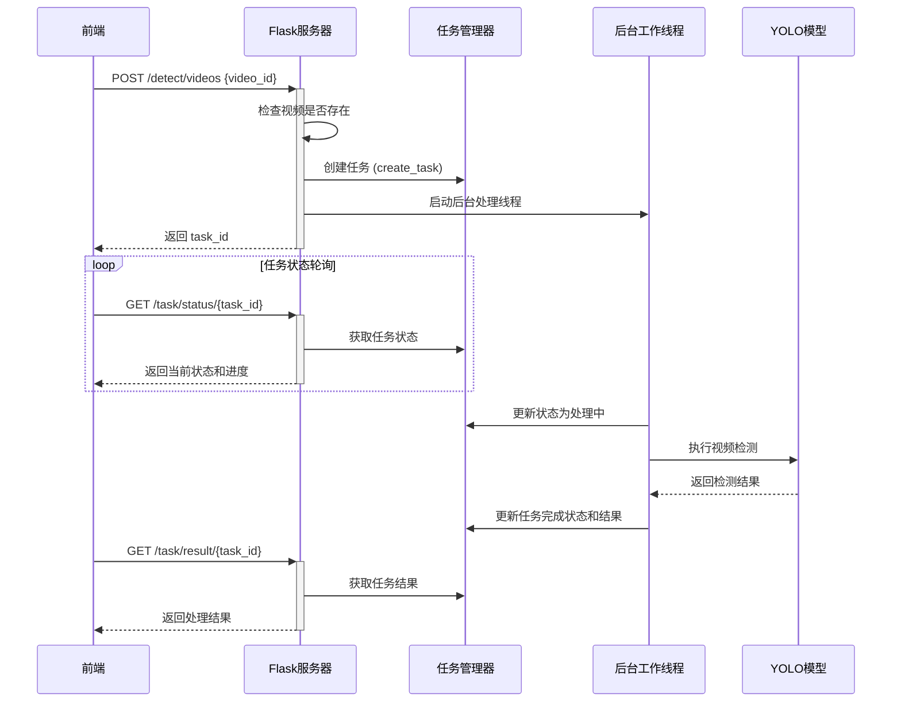

# README

第十六届中国大学生服务外包创新创业大赛：T2405446-火眼晶晶-A25浓烟环境人体目标判别-基于浓烟环境人体目标识别系统源码

## 测试数据集：test_data

本测试数据集包含以下五个部分，分别对应不同的处理和识别任务：

1. **dehaze**  
   图像去烟处理

2. **image_identify**  
   图像识别

3. **video_identify**  
   视频识别

4. **fusion**  
   融合识别（太大了，放不上去）

5. **val**  
   识别性能评估
