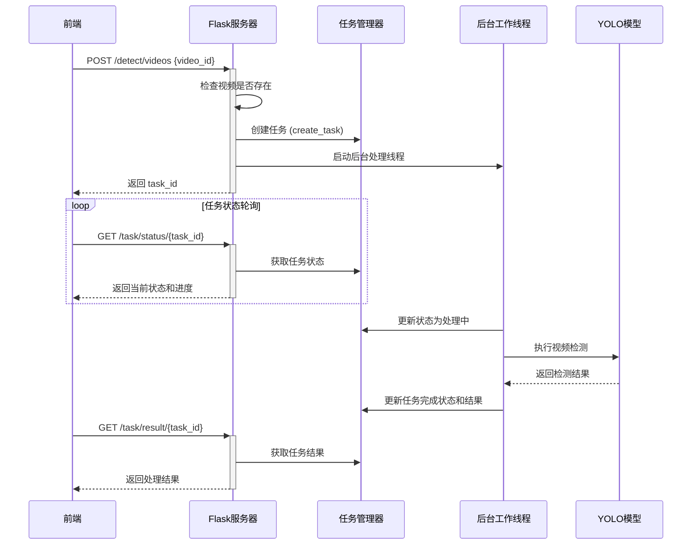

# README

第十六届中国大学生服务外包创新创业大赛：T2405446-火眼晶晶-A25浓烟环境人体目标判别-基于浓烟环境人体目标识别系统源码

## 项目简介

本项目是一个基于Vue+Flask的浓烟环境人体识别系统，运行后可以通过浏览器访问，并提供特定功能。以下是项目的详细说明和操作指南。

---

## 系统启动

1. **运行系统**  
   在项目根目录下执行以下命令以启动系统：
   ```bash
   python main.py

启动成功后，系统会运行在本地服务器上。

2. **访问系统**  
    打开浏览器并访问以下地址：
   ```bash
    http://127.0.0.1:5000

## 模型配置

1. **模型存放位置**  
    所有可用模型需放置在model文件夹下。确保模型文件完整且符合系统的加载要求。

2. **模型选择**  
    系统支持多模型切换，具体模型的选择方式如下：
    - 将需要使用的模型文件放入`model`文件夹。
    - 修改配置文件或通过界面选择目标模型（根据实际功能实现）。

    > **注意**：  
    > - 模型文件格式需符合系统要求（如`.pt`, `.h5`, `.pkl`等）。  
    > - 确保模型文件与代码兼容，避免因版本问题导致加载失败。

## 测试数据集：test_data

本测试数据集包含以下五个部分，分别对应不同的处理和识别任务：

1. **dehaze**  
   图像去烟处理

2. **image_identify**  
   图像识别

3. **video_identify**  
   视频识别

4. **fusion**  
   融合识别（太大了，放不上去）

5. **val**  
   识别性能评估

系统采用的测试数据集：[测试数据集.rar](https://pan.baidu.com/s/11-Ke12kOIBd0sVxTM7H3kg) 提取码: bi4u

## 视频识别和识别评估流程图


## 常见问题

### 无法启动系统
- 确保已正确安装所有依赖库。
- 检查端口`5000`是否被占用，若有冲突可修改`main.py`中的端口号。

### 模型加载失败
- 确认模型文件路径是否正确。
- 检查模型文件格式是否符合要求。

### 访问页面空白
- 确保模板文件（HTML）和静态资源文件（CSS/JS）路径正确。
- 查看终端日志，定位可能的错误信息。
