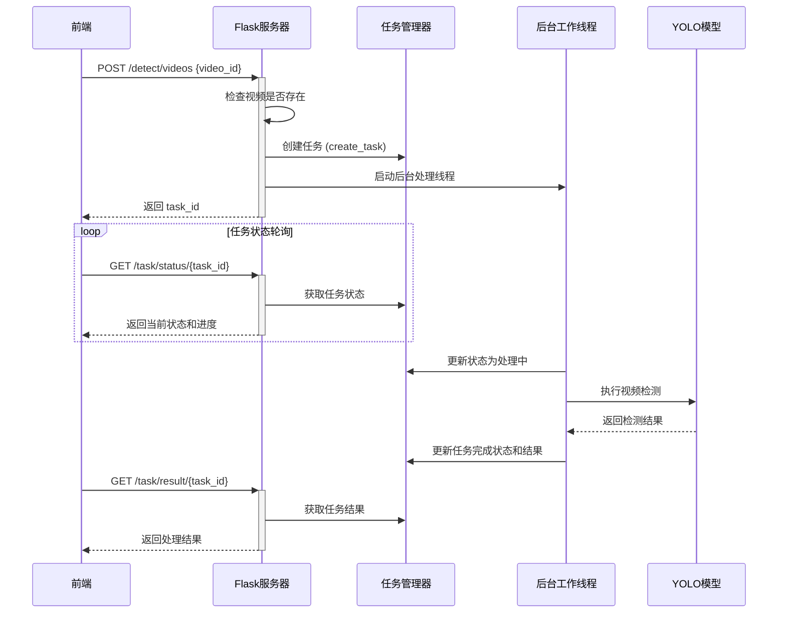

# README

```mermaid
sequenceDiagram
    participant Client as 前端
    participant Server as Flask服务器
    participant TaskManager as 任务管理器
    participant Worker as 后台工作线程
    participant YOLO as YOLO模型

    Client->>+Server: POST /detect/videos {video_id}
    Server->>Server: 检查视频是否存在
    Server->>TaskManager: 创建任务 (create_task)
    Server->>Worker: 启动后台处理线程
    Server-->>-Client: 返回 task_id

    loop 任务状态轮询
        Client->>+Server: GET /task/status/{task_id}
        Server->>TaskManager: 获取任务状态
        Server-->>-Client: 返回当前状态和进度
    end

    Worker->>TaskManager: 更新状态为处理中
    Worker->>YOLO: 执行视频检测
    YOLO-->>Worker: 返回检测结果
    Worker->>TaskManager: 更新任务完成状态和结果

    Client->>+Server: GET /task/result/{task_id}
    Server->>TaskManager: 获取任务结果
    Server-->>-Client: 返回处理结果
```
